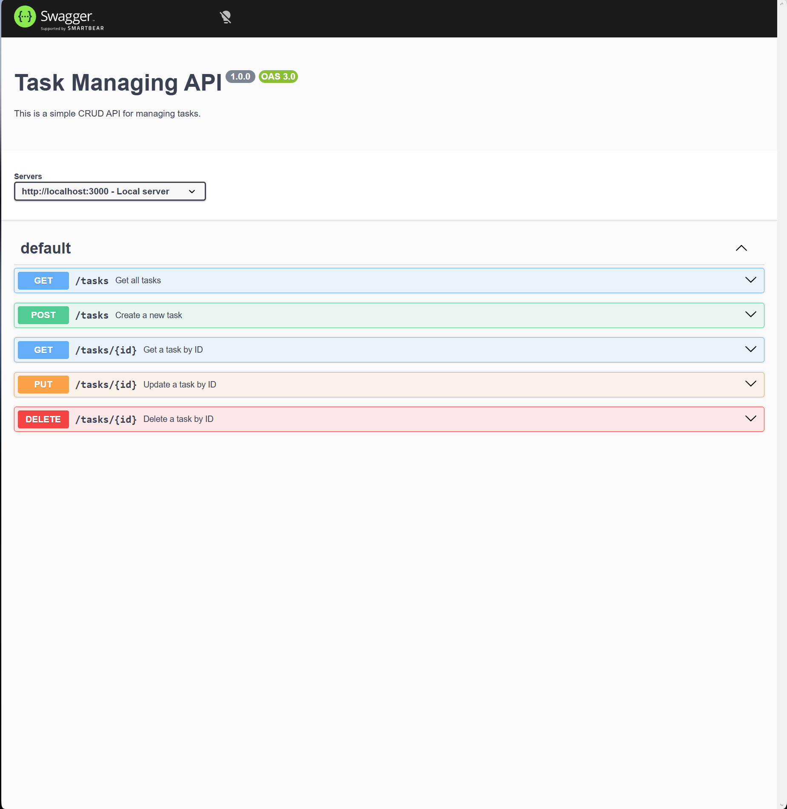

# TASK MANAGER SIMPLE CRUD API

## 1. What This Is
A simple RESTful CRUD API built with Express.js.
The API allows users to create, retrieve, update, and delete tasks. It also includes Swagger documentation available at `/docs`.

## 2. Installation
Since this is built with Express.js. You should have Node.js and Node Package Manager (npm) installed.
Then run this in your Terminal:
```
npm install
```
```
npm install express
```
If you want to run SwaggerUI to see how the endpoints work, then install `swagger-ui-express`:
```
npm install swagger-ui-express
```
## 3. Run this project
Simply run this in your Terminal with your directory is in the `myapp` folder:
```
node app.js
```
or
```
npm start
```
## 4. Report endpoint table
| Method | Endpoint | Description |
|--------|----------|-------------|
| GET | / | API information |
| GET | /health | Health check |
| GET | /tasks | Retrieve all tasks |
| GET | /tasks/:id | Retrieve one task |
| POST | /tasks | Create a new task |
| PUT | /tasks/:id | Update an existed task |
| DELETE | /tasks/:id | Delete an existed task |
| GET | /docs | Swagger UI |

### Example curl output
```
curl -i -X 'GET'   'http://localhost:3000/tasks'
```

```
HTTP/1.1 200 OK
X-Powered-By: Express
Content-Type: application/json; charset=utf-8
Content-Length: 131
ETag: W/"83-YRIExQgTwwpduFFEjbyrr3PaPPs"
Date: Wed, 15 Jul 2026 23:12:50 GMT
Connection: keep-alive
Keep-Alive: timeout=5

[{"id":1,"title":"Task 1","completed":true},{"id":2,"title":"Task 2","completed":true},{"id":3,"title":"Task 3","completed":false}]
```

## 4. Swagger UI Documentation

